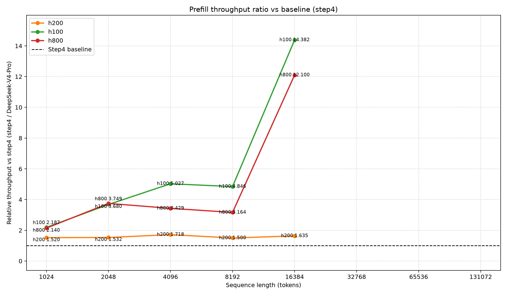
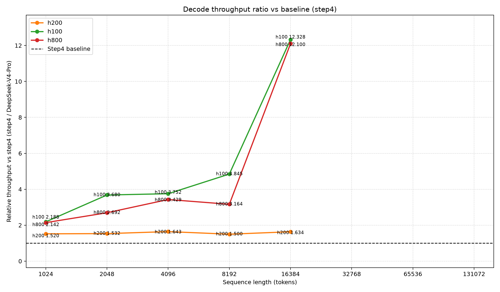

## Modification History

| Date | Summary of Changes |
|---|---|
| 2026-07-15 | Linked the completed current-source four-system menu after the GB300 throughput shard finished |
| 2026-07-15 | Created the current-source non-GB300 throughput-ratio menu from strict-contract v3 shards |

# Throughput-Ratio Figure Menu — Current-Source Non-GB300 Systems

This is the preserved early-review menu for the completed non-GB300 systems. H200, H100, and H800 were rerun against the current runner source, and every checkpoint header matches its current execution contract. GB300 is intentionally excluded from this snapshot.

The authoritative all-GPU current-source menu is now available at [figures_final_v3](../figures_final_v3/README.md).

## Figures

| Figure | Description | File |
|---|---|---|
| Fig. 1 | Prefill throughput ratio, Step4 / DeepSeek-V4-Pro | [fig1_prefill_throughput_ratio.png](fig1_prefill_throughput_ratio.png) |
| Fig. 2 | Decode throughput ratio, Step4 / DeepSeek-V4-Pro | [fig2_decode_throughput_ratio.png](fig2_decode_throughput_ratio.png) |
| Data | Combined rank-one rows, ratios, and missing-point inventory | [combined_results.json](combined_results.json) |

## Inline Preview

### Fig. 1 — Prefill

### Fig. 2 — Decode

## Included Systems and Contracts

| Display System | Source System | Current Contract | Provenance |
|---|---|---|---|
| H200 | h200_sxm | 8d86bc5e230b0d6404e6de4930e57337442e2db8031939ca7358df6280e82b5e | SOL |
| H100 | h100_sxm | 58638b227687f247ea8c208589a95c8a6d4076741ebfc824838204b4ea2d93d3 | SOL |
| H800 | h800_sxm | 41ac60b60c5a26c8acfd9b3983e9caef7c70a5506b8980e2eb169a9737293e62 | simulated SOL; not a silicon measurement |

Every selected rank-one row satisfies strict TTFT < 5000 ms. Missing model/system/ISL pairs are not fabricated; they remain explicit gaps and are listed in combined_results.json.

## Data Coverage

| Item | Value |
|---|---:|
| Source shards | 3 |
| Completed mode runs | 48 (16 per system) |
| Rank-one rows | 34 |
| Paired ratio points | 15 |
| Missing ratio points | 9 |
| Stored prefill/decode ratios | 30 |
| ISL values requested per system | 8 |
| ISL values with paired ratios per system | 5 (1024–16384) |

## v2/v3 Reproducibility Result

After normalizing only the checkpoint execution-contract hash and source-result path:

- all three v2/v3 shard scientific payloads are identical;
- the combined v2/v3 ratio payloads are identical;
- both v2/v3 PNG files are byte-for-byte identical.

The v3 rerun changes provenance, not the reported scientific values.

## Reproducible Command

    ROOT=task_memory/task_2026-07-14_dsv4pro_vs_step4_throughput_figures
    PY=/home/i-fengyicheng/miniconda3/envs/aic-step-design/bin/python

    MPLBACKEND=Agg PYTHONPATH=src:. "$PY"       -m tests.performance.aic_roofline_pareto.plot_throughput_ratio       "$ROOT/results/full-v3-h200_sxm/results.json"       "$ROOT/results/full-v3-h100_sxm/results.json"       "$ROOT/results/full-v3-h800_sxm/results.json"       --output-dir "$ROOT/results/figures_completed_v3"       --combined-output "$ROOT/results/figures_completed_v3/combined_results.json"
