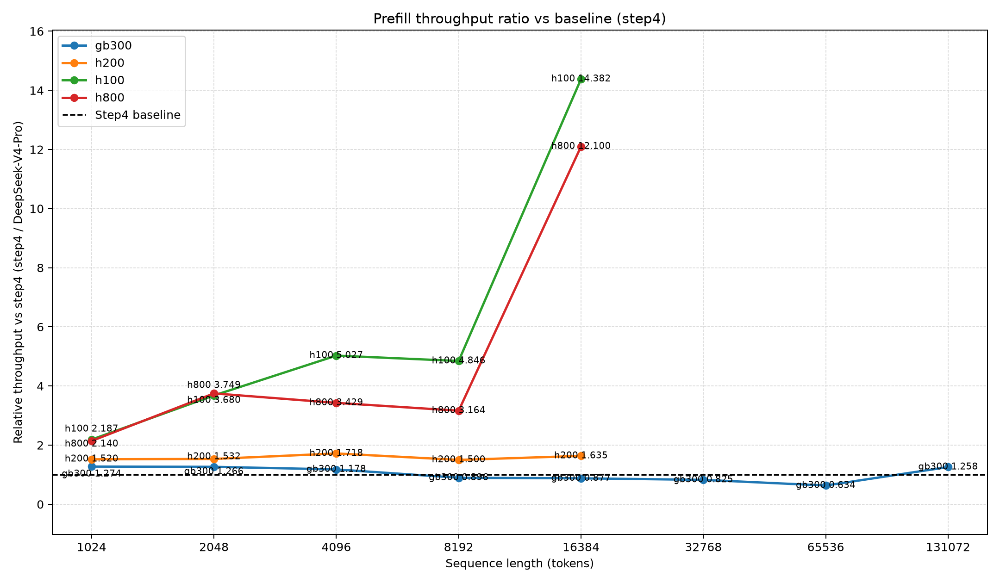
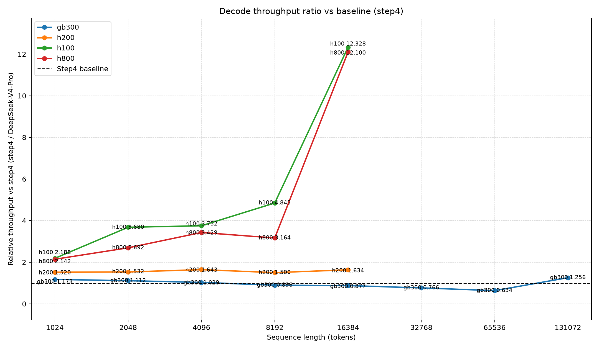

## Modification History

| Date | Summary of Changes |
|---|---|
| 2026-07-15 | Created the current-source four-system throughput-ratio menu from strict-contract v3 shards |

# Throughput-Ratio Figure Menu — All GPU Types (Current Source)

This is the authoritative all-GPU menu generated from the completed current-source v3 throughput shards for GB300, H200, H100, and H800. Every shard checkpoint matches its current execution contract and Git HEAD `9ce84ebbe3a0d7f785c91d055bdbdf4fdaabcbf1`.

The earlier non-GB300 snapshot remains available at [figures_completed_v3](../figures_completed_v3/README.md).

## Figures

| Figure | Description | File |
|---|---|---|
| Fig. 1 | Prefill throughput ratio, `Step4 / DeepSeek-V4-Pro` | [fig1_prefill_throughput_ratio.png](fig1_prefill_throughput_ratio.png) |
| Fig. 2 | Decode throughput ratio, `Step4 / DeepSeek-V4-Pro` | [fig2_decode_throughput_ratio.png](fig2_decode_throughput_ratio.png) |
| Data | Combined rank-one rows, ratios, and missing-point inventory | [combined_results.json](combined_results.json) |

## Inline Preview

### Fig. 1 — Prefill

### Fig. 2 — Decode

## Included Systems and Contracts

| Display System | Source System | Current Contract | Provenance |
|---|---|---|---|
| GB300 | gb300 | `ab6d3a7f252f0e4e3c254f8fa03669ad0526f55e432a43d1c97f63abe6bd603e` | SOL |
| H200 | h200_sxm | `8d86bc5e230b0d6404e6de4930e57337442e2db8031939ca7358df6280e82b5e` | SOL |
| H100 | h100_sxm | `58638b227687f247ea8c208589a95c8a6d4076741ebfc824838204b4ea2d93d3` | SOL |
| H800 | h800_sxm | `41ac60b60c5a26c8acfd9b3983e9caef7c70a5506b8980e2eb169a9737293e62` | simulated SOL; not a silicon measurement |

Every selected rank-one row satisfies strict `TTFT < 5000 ms`. Missing model/system/ISL pairs are not fabricated; they remain explicit gaps in `combined_results.json`.

## Data Coverage

| Item | Value |
|---|---:|
| Source shards | 4 |
| Completed mode runs | 64 (16 per system) |
| AA/AB/BA/BB terminal outcomes | 256 |
| Rank-one rows | 50 |
| Paired ratio points | 23 |
| Missing ratio points | 9 |
| Stored prefill/decode ratios | 46 |

## Strict TTFT Evidence

| System | Maximum rank-one TTFT | Margin below 5000 ms |
|---|---:|---:|
| GB300 | `4176.999 ms` | `823.001 ms` |
| H200 | `3431.264 ms` | `1568.736 ms` |
| H100 | `3718.155 ms` | `1281.845 ms` |
| H800 simulated SOL | `3832.023 ms` | `1167.977 ms` |

## v2/v3 Reproducibility Result

After normalizing only each checkpoint execution-contract hash and the four combined source-result paths:

- all four v2/v3 shard scientific payloads are identical;
- all 46 stored ratios recompute with maximum absolute delta `0.0`;
- both v2/v3 PNG files are byte-for-byte identical.

The v3 rerun corrects strict source provenance; it does not change the reported scientific values.

## Figure SHA256

| File | SHA256 |
|---|---|
| `combined_results.json` | `2ac69e74cb1054e83e6077b7b79faa0e62a23d20ea2a5ce8690f69f414c9c3e0` |
| `fig1_prefill_throughput_ratio.png` | `a1059fa972b275ceaf9b7c8a6eef244a7a5aa423b3f8d333b945b2bc56c61b1c` |
| `fig2_decode_throughput_ratio.png` | `eca2b011c4624de469512243f4e441d5c7b9f73369b80f0bff8fac65f6c81e05` |

## Reproducible Command

    ROOT=task_memory/task_2026-07-14_dsv4pro_vs_step4_throughput_figures
    PY=/home/i-fengyicheng/miniconda3/envs/aic-step-design/bin/python

    MPLBACKEND=Agg PYTHONPATH=src:. "$PY" \
      -m tests.performance.aic_roofline_pareto.plot_throughput_ratio \
      "$ROOT/results/full-v3-gb300/results.json" \
      "$ROOT/results/full-v3-h200_sxm/results.json" \
      "$ROOT/results/full-v3-h100_sxm/results.json" \
      "$ROOT/results/full-v3-h800_sxm/results.json" \
      --output-dir "$ROOT/results/figures_final_v3" \
      --combined-output "$ROOT/results/figures_final_v3/combined_results.json"
